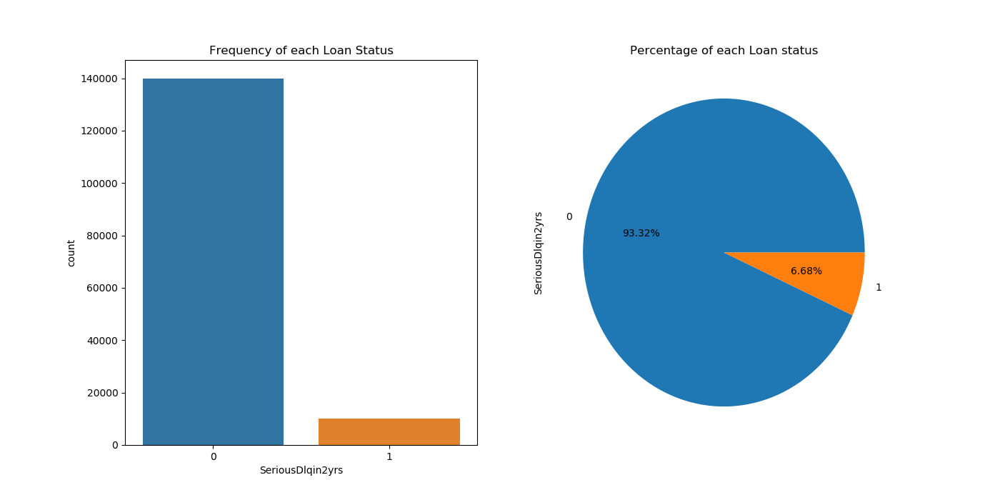
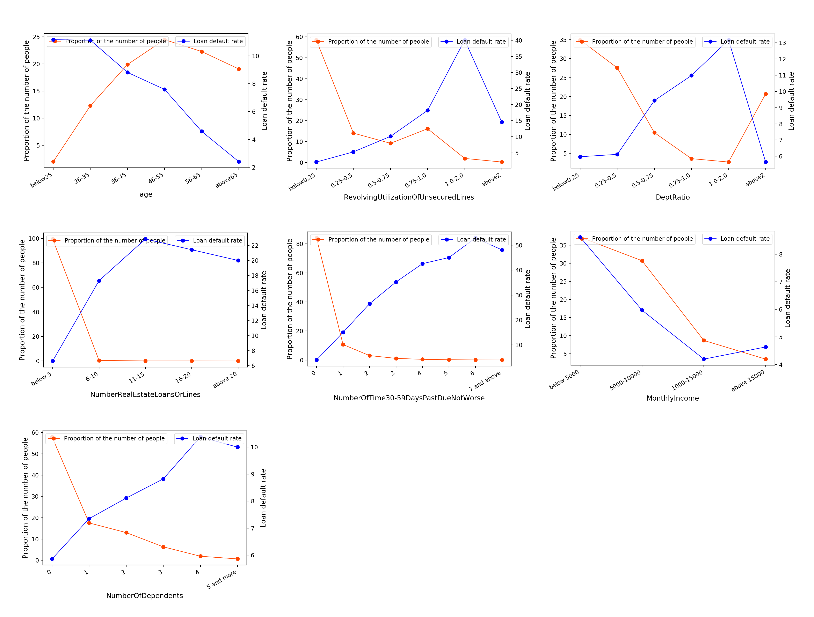
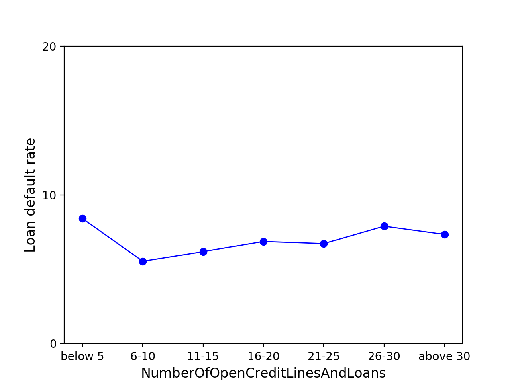
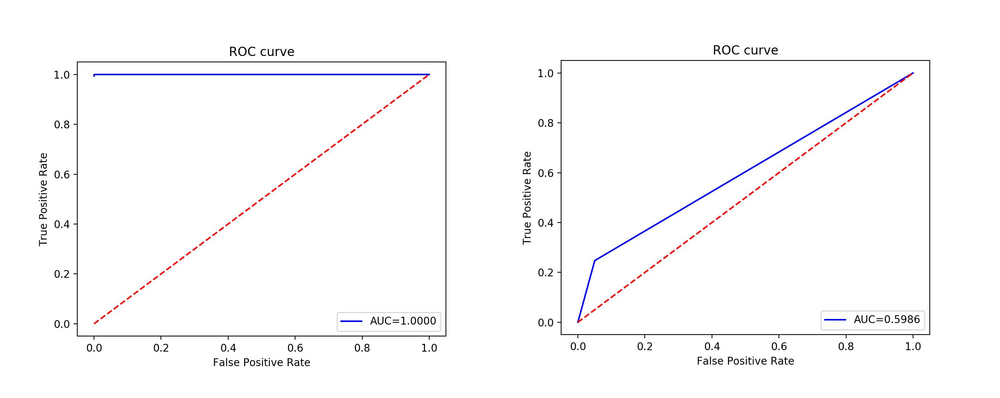
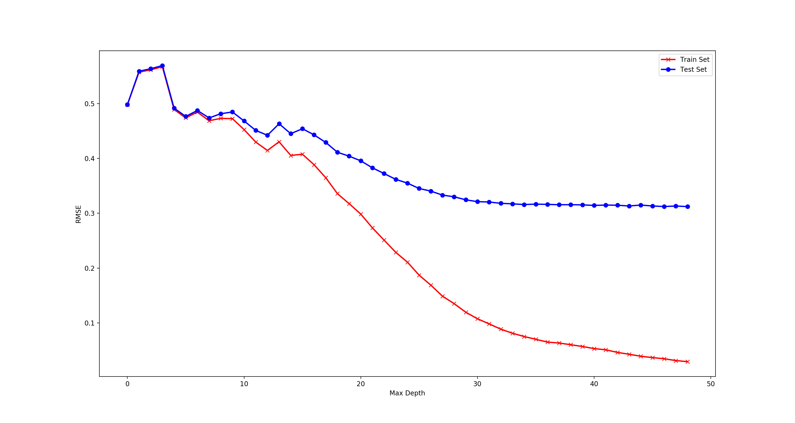
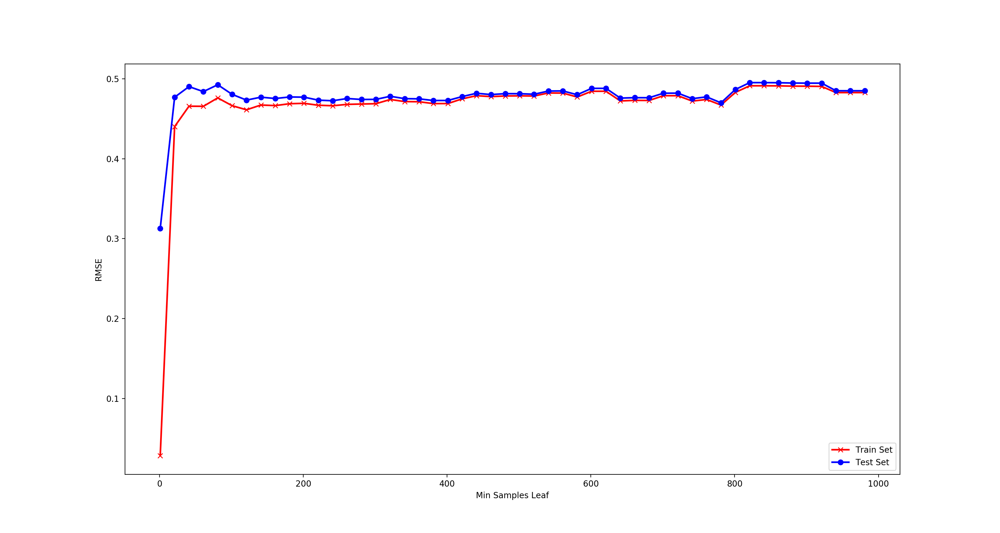
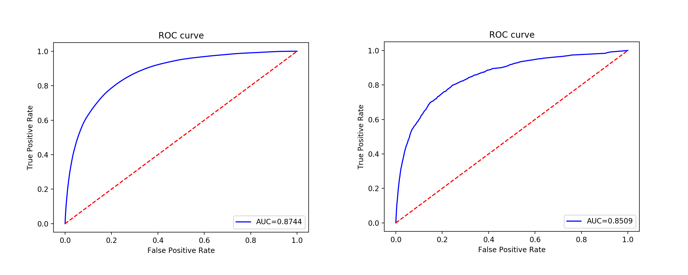
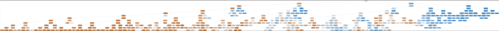
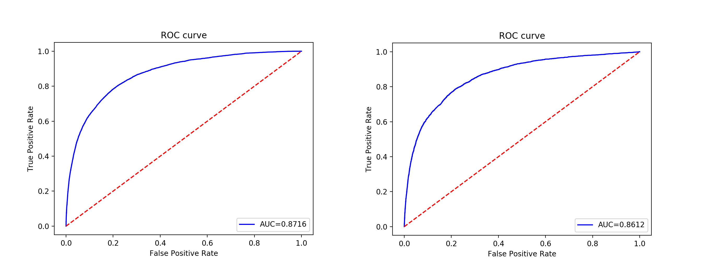
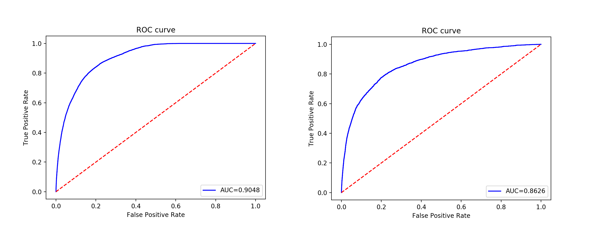

# 贷款违约预测

## 1 数据预处理和分析

### 1.1 数据字典和缺失值统计

数据集来自 Kaggle 竞赛平台的一个贷款违约数据集，有两个数据集，一个是带标签的训练集，数据共有 150000 个样本;另一个是测试集，有 101503 个样本。训练集的样本共有 11 个属性，其中SeriousDlqin2yrs是数据集的标签属性，其他为特征属性。

|                属性名                |           含义           | 数据类型 |
| :----------------------------------: | :----------------------: | :------: |
|           SeriousDlqin2yrs           |      借款人是否违约      |   0/1    |
| RevolvingUtilizationOfUnsecuredLines | 贷款总额与授信额度的比率 |  百分比  |
|                 age                  |           年龄           |   整数   |
| NumberOfTime30-59DaysPastDueNotWorse |   逾期 30-59 天的次数    |   整数   |
|              DebtRatio               |        资产负债率        |  百分比  |
|            MonthlyIncome             |          月收入          |   整数   |
|   NumberOfOpenCreditLinesAndLoans    |       开放贷款数量       |   整数   |
|       NumberOfTimes90DaysLate        |  逾期 90 天及以上的次数  |   整数   |
|     NumberRealEstateLoansOrLines     |  抵押和房地产贷款的次数  |   整数   |
| NumberOfTime60-89DaysPastDueNotWorse |   逾期 60-89 天的次数    |   整数   |
|          NumberOfDependents          |         家属数量         |   整数   |

使用Numpy和Pandas对各个属性列的缺失值情况进行统计。结合存在缺失值的属性的含义，决定使用所在列的平均值去填充它们。

|                属性名                | 缺失数量 |                属性名                | 缺失数量 |
| :----------------------------------: | :------: | :----------------------------------: | :------: |
|           SeriousDlqin2yrs           |    0     |   NumberOfOpenCreditLinesAndLoans    |    0     |
| RevolvingUtilizationOfUnsecuredLines |    0     |       NumberOfTimes90DaysLate        |    0     |
|                 age                  |    0     |     NumberRealEstateLoansOrLines     |    0     |
|              DebtRatio               |    0     |          NumberOfDependents          |   3924   |
| NumberOfTime30-59DaysPastDueNotWorse |    0     | NumberOfTime60-89DaysPastDueNotWorse |    0     |
|            MonthlyIncome             |  29731   |                                      |          |

### 1.2 数据类别分布

对数据集进行标签类别的统计，可以看出明显的类别不平衡，需要在后面的训练过程中使用代价敏感学习方法。

### 1.3 相关性分析

这里主要进行各个特征属性和标签属性间的相关性分析，方法是将属性列分段，分别统计各段上的人数占比和违约率情况，可以看出下图中的各个特征都与标签具有强的相关性。

这里需要特别注意的是开放贷款数量这个特征属性，各个区间段上的违约率情况如下。

|  次数  |  小于5  |  6~10   |  11~15  |  16~20  |  21~25  |  26~30  | 大于30  |
| :----: | :-----: | :-----: | :-----: | :-----: | :-----: | :-----: | :-----: |
| 违约率 | 8.41812 | 5.53808 | 6.18147 | 6.86573 | 6.72298 | 7.89809 | 7.34463 |

计算出标准差为，变异系数。可以说这个特征与标签是弱相关的，可以剔除。

## 2 模型的构建和训练

首先使用 Scikit-Learn 中的 StratifiedShuffleSplit 函数对训练集按7:3的比例进行分割，得到新的训练集和测试集用于模型的训练和评估。

### 2.1 Logistic 回归模型的构建和训练

在 Scikit-Learn 中可以通过 LogisticRegression 函数构建出一个 Logistic 回归分类器，将这个分类器的 class_weight 参数值设为balanced，让分类器可以自动地设置并调整权重。训练和测试得到的ROC曲线图如下。

### 2.2 决策树模型的构建和训练

#### 2.2.1 初始模型

这里直接使用DecisionTreeClassifier函数来构建一个决策树分类器，class_weight 参数值设为balanced。在训练集和测试集上的ROC曲线图如下，可以发现出现了明显的过拟合。

#### 2.2.2 正则化超参数

首先探究一下max_depth这个参数的学习曲线，它规定了决策树的最大深度。

可以清楚的发现参数 max_depth 在小于 10 这个值的时候，模型在两个数据集上的表现几乎差不多，但均方根误差较大。当超过 10 这个数值的时候，两条曲面开始 分离，并且差距越来大。带叉号的曲线快速下降并且越来越靠近坐标轴，说明随着树高的 增加，模型在训练集上的误差越来越小，但是带圆点的曲线逐渐趋于平缓并越来越靠近均方根误差等于 0.3 的水平线，说明在测试集上的误差逐渐趋于 0.3 左右，模型的性能趋于饱和。

接下来考察 min_samples_leaf 参数的学习曲线，它规定了决策树叶子结点必须满足的最小样本数量。

这里可以发现，叶子结点最小样本量越低，模型的性能越好，最小样本量达到 200 左右时，模型在两个数据集上的性能几乎近似。但是，最小样本量在小于 100 时，两条曲面都表现的很陡峭,并且在训练集上表现的误差都是比在测试集上的误差小的多。

#### 2.2.3 优化后的模型

通过上面的分析，确定了最优参数的大致范围。在通过多次调参之后，选定max_depth=12，min_samples_leaf=200为最终参数。重新训练和测试之后得到下面的ROC曲线图。

明显的，过拟合的问题得到了解决，并取得比Logistic回归模型更好的性能。这里不妨将决策树可视化的输出出来看看树的形态，因为图片太大（有7MB），这里只展示全貌的截图，。

发现得到的决策树的树深和叶子结点数量并不是很多，模型不复杂，没有过拟合。

### 2.3 AdaBoost 自适应提升模型的构建和训练

现在考虑尝试使用自适应提升法来集成多个决策树分类器，前面提到的，这是对多个学习器的一个线性组合。现在使用 AdaBoostClassifier 函数来构建一个集成的模型，单个学习器设置为采用代价敏感学习、最大深度为 5，允许叶子结点分裂的最小样本量为 50的决策树，在集成模型里设置参数 n_estimators 为 10，algorithm 为 SAMME.R,learning_rate 为 0.4，分别表示集成 10个决策树，使用 SAMME.R 算法，这个参数表示使用多类指数损失函数的逐步添加模型，学习率参数设置为 0.4。训练和测试之后得到下面的ROC曲线图。

发现比之前的决策树模型取得了更好的性能。

### 2.4 随机森林模型的构建和训练

尝试使用更复杂的集成学习方法——随机森林，首先使用RandomForestClassifier 函数构建一个随机森林学习器，初始化参数 n_estimators=100、min_samples_split=2，min_samples_leaf=50，表示设置采用 100 棵决策树来集成，结点分裂时的最小样本量为 2，叶子节点的最小样本量为 50，因为采用了集成学习，所以对单棵决策树来说可以对参数的正则化要求不那么严格。对学习器的其他参数决定使用网格搜索进行参数优化，评分机制设定为roc_auc，训练和测试之后得到下面的ROC曲线图。

可以看到随机森林模型取得了最优的成绩。

在机器学习库 Scikit-Learn 的随机森林模型部分提供了 feature_importances_参数来存储每个特征属性的重要性得分情况，现在通过它来得到每个特征的重要程度，并按照得分进行降序排序 。

|    特征名    |  得分  |    特征名    |  得分  |
| :----------: | :----: | :----------: | :----: |
| RUUnsecuredL | 0.3514 |     Age      | 0.0722 |
|   NOTims90   | 0.1695 |    Income    | 0.0542 |
| NOTime30-59  | 0.1613 | NORealEstate | 0.0245 |
| NOTime60-89  | 0.0816 | NODependents | 0.0125 |
|  DebtRatio   | 0.0729 |              |        |

可以知道最重要的 3 个特征为贷款总额与授信额度的比率、逾期 90 天 以上的次数和逾期 30 到 59 的次数，得分为 0.3514、0.1695 和 0.1613，结果也符合之前所作的特征相关性的分析。 
